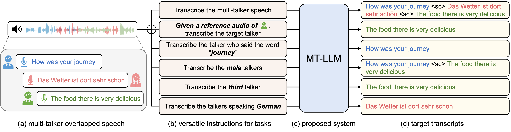

# Large Language Model Can Transcribe Speech in Multi-Talker Scenarios with Versatile Instructions

><em> in International Conference on Acoustics, Speech, and Signal Processing (ICASSP), 2025 
<br> Authors: Lingwei Meng, Shujie Hu, Jiawen Kang, Zhaoqing Li, Yuejiao Wang, Wenxuan Wu, Xixin Wu, Xunying Liu, Helen Meng</em>

[Paper Link](https://ieeexplore.ieee.org/abstract/document/10887642/) | [Citation](#citation)

This repository contains the implementation of the **MT-LLM** model for instruction-based multi-talker overlapped speech recognition.

<div align=center>
  
</div>


## Setup

```bash
cd MT-LLM/
git submodule update --init fairseq
conda create -n mtllm python=3.10.16; conda activate mtllm
pip install --editable fairseq/
pip install sentencepiece
pip install transformers==4.32.1
pip install numpy==1.23.5
pip install editdistance
pip install soundfile
```

## Download the Trained Model

The trained MT-LLM model weights can be downloaded from [here](https://huggingface.co/LingweiMeng/MT-LLM). 


## Inference
```bash
cp -r mtllm fairseq/examples
cd fairseq
data_name=for_demo
bash examples/mtllm/scripts/inference.sh $model_path $data_name
```
We provided several examples in [`test_data`](mtllm/test_data)

## Demos
| Task |  Audio | #Speakers | Instruction |  Output |
| :-----: | :-----: | :-----: |  :-----: | :-----: |
| Multi-Talker ASR | [`audio`](mtllm/test_data/audio/test-clean-2mix-0728.wav) | 2 | Transcribe the given audio into text. If multiple speakers are speaking, transcribe the utterances of multiple speakers in the order of their start times, separated by "**\<sc\>**". | two monsters only were creating all this commotion and before my eyes are two reptiles of the primitive world **\<sc\>** to relieve her from both he laid his hand with force upon his heart and said do you relieve me |
| Sex-Specific ASR | [`audio`](mtllm/test_data/audio/test-clean-2mix-0728.wav) | 2 | Please transcribe the contents spoken by **female** speakers in overlapping speech. | to relieve her from that he laid his hand with force upon his heart and said do you believe me |
| Keyword-Tracing ASR | [`audio`](mtllm/test_data/audio/test-clean-2mix-0728.wav) | 2 | Please transcribe the speech of the speaker who said the word "**reptiles**" in the overlapping speech audio. | two monsters only were creating all this commotion and before my eyes are two reptiles of the primitive world |
| Order-Specific ASR | [`audio`](mtllm/test_data/audio/test-clean-2mix-0728.wav) | 2 | There are multiple speakers in the audio. Please transcribe the speech of the **first** speaker into text. | two monsters only were creating all this commotion and before my eyes are two reptiles of the primitive world |
| Target-Lingual ASR | [`audio`](mtllm/test_data/audio/common-voice-de-20014556_3575-170457-0004.wav) | 2 | Please transcribe the person speaking **German** from the overlapping speech audio. | Mit dem Aufkommen des Christentums verloren die römischen Circusse an Bedeutung |
| | | | | |
| Multi-Talker ASR | [`audio`](mtllm/test_data/audio/test-clean-3mix-1307.wav) | 3 | Transcribe the given audio into text. If multiple speakers are speaking, transcribe the utterances of multiple speakers in the order of their start times, separated by "**\<sc\>**". | well mother said the young student looking up with a shade of impatience **\<sc\>** otherwise paul should have written grace from god the father and peace from our lord jesus christ **\<sc\>** consumption becomes a larger element in the standard of living in the city than in the country |
| Sex-Specific ASR | [`audio`](mtllm/test_data/audio/test-clean-3mix-1307.wav) | 3 | Please transcribe the contents spoken by **female** speakers in overlapping speech. | well mother said the young student looking up with a shade of impatience **\<sc\>** consumption becomes a larger element in the standard of living in the city than in the country |
| Keyword-Tracing ASR | [`audio`](mtllm/test_data/audio/test-clean-3mix-1307.wav) | 3 | Please transcribe the speech of the speaker who said the word "**impatience**" in the overlapping speech audio. | well mother said the young student looking up with a shade of impatience |
| Order-Specific ASR | [`audio`](mtllm/test_data/audio/test-clean-3mix-1307.wav) | 3 | There are multiple speakers in the audio. Please transcribe the speech of the **second** speaker into text. | otherwise paul should have written grace from god the father and peace from our lord jesus christ |
| Target-Lingual ASR | [`audio`](mtllm/test_data/audio/4198-61336-0009_common-voice-de-19162009_4077-13754-0013.wav) | 3 | Please transcribe the person speaking **English** from the overlapping speech audio. | for three years he conducted vigorous campaigns in the western land where he met with vigorous resistance **\<sc\>** before the stragglers on the administration of law could be brought before the court of last resort and there met with the reversal and rebuke it deserved men were imprisoned under sentence of many years duration |


## Related works
- Empowering **Whisper** for multi-talker and target-talker ASR
[](https://arxiv.org/abs/2407.09817)
 [](https://github.com/LingweiMeng/Whisper-Sidecar)
- Sidecar: Convert a **single-talker** ASR systems to **multi-talker** one [](https://arxiv.org/abs/2302.09908)
- Unified modeling of **multi-talker** speech recognition and **diarization** [](https://arxiv.org/abs/2305.16263)
- SA-CTC: A **speaker-aware CTC** for multi-talker overlapped speech recognition [](https://arxiv.org/abs/2409.12388)
 [](https://github.com/kjw11/Speaker-Aware-CTC)
- CSE-NET: A **SOTA network** architecture for multi-talker speech recognition
 [](https://arxiv.org/abs/2401.04152)
 [](https://github.com/kjw11/CSEnet-ASR)


## Citation

If you find our work is useful in your research, please cite the following paper:

```bibtex
@inproceedings{meng2025mtllm,
    title={Large Language Model Can Transcribe Speech in Multi-Talker Scenarios with Versatile Instructions},
    author={Meng, Lingwei and Hu, Shujie and Kang, Jiawen and Li, Zhaoqing and Wang, Yuejiao and Wu, Wenxuan and Wu, Xixin and Liu, Xunying and Meng, Helen},
    booktitle={ICASSP 2025-2025 IEEE International Conference on Acoustics, Speech and Signal Processing (ICASSP)},
    year={2025}
}
```
```bibtex
@article{hu2024wavllm,
    title={WavLLM: Towards Robust and Adaptive Speech Large Language Model}, 
    author={Shujie Hu, Long Zhou, Shujie Liu, Sanyuan Chen, Lingwei Meng, Hongkun Hao, Jing Pan, Xunying Liu, Jinyu Li, Sunit Sivasankaran, Linquan Liu, Furu Wei},
    year={2024},
    eprint={2404.00656},
    archivePrefix={arXiv},
}
```

## Acknowledgements

We have referenced a lot of code from [WavLLM](https://github.com/microsoft/SpeechT5/tree/main/WavLLM).

Portions of the source code are based on the [FAIRSEQ](https://github.com/pytorch/fairseq) and [AV_HuBERT](https://github.com/facebookresearch/av_hubert).
